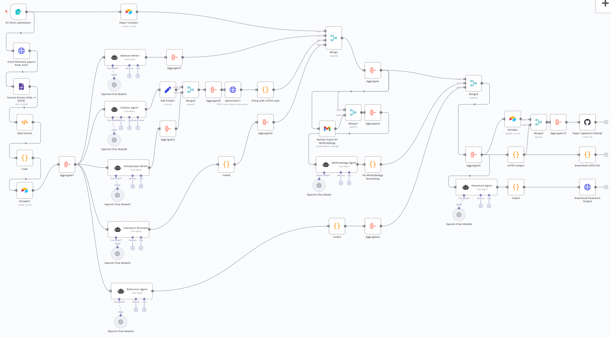
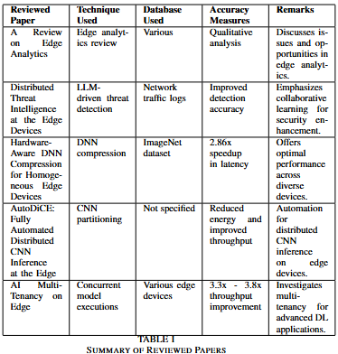
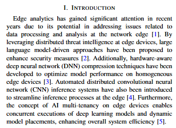
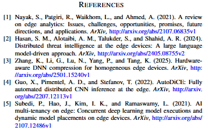
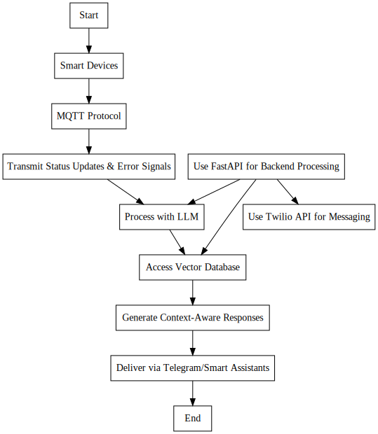

# AI-Powered Research Agent 🚀

This project automates the end-to-end academic research workflow using n8n and large language models like OpenAI GPT and DeepSeek.

---

## 🔧 Workflow Overview

---

## 📄 Auto-Generated Review Table from review papers

---

## 🔧 Auto-citation using References from review papers

---
## 🔁 Flowchart from Methodology

---

## 📊 Results Summary

- ⏱️ 95%+ time saved over traditional methods  
- ✅ Only 6% similarity score (Turnitin)  
- 📤 Outputs stored to Github, citations managed via Airtable

---

## ⚙️ Technologies Used

- n8n (workflow automation)
- OpenAI GPT (via API)
- Airtable (reference database)
- QuickChart (Graphviz rendering)
- LaTeX (IEEE format export)

